# Lock

## Introduction
In this report we will see both the circuit simulation and the actual programming of a safe. Next, we will look at both the general and individual flow diagrams.

### General flow chart.
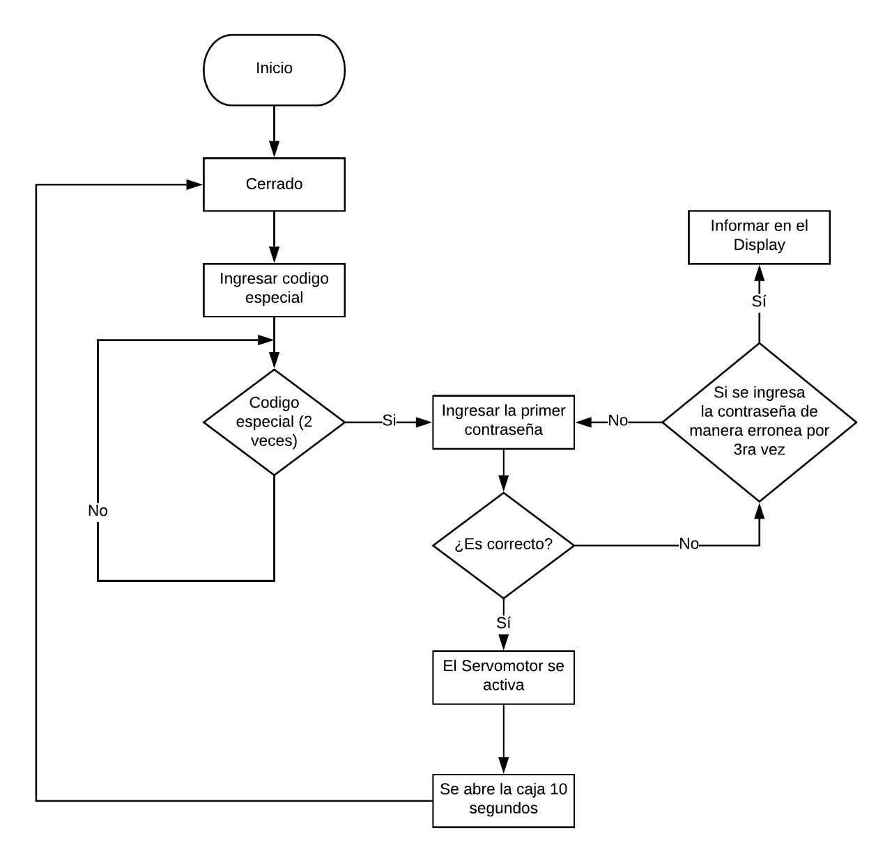

### Circuit diagram.
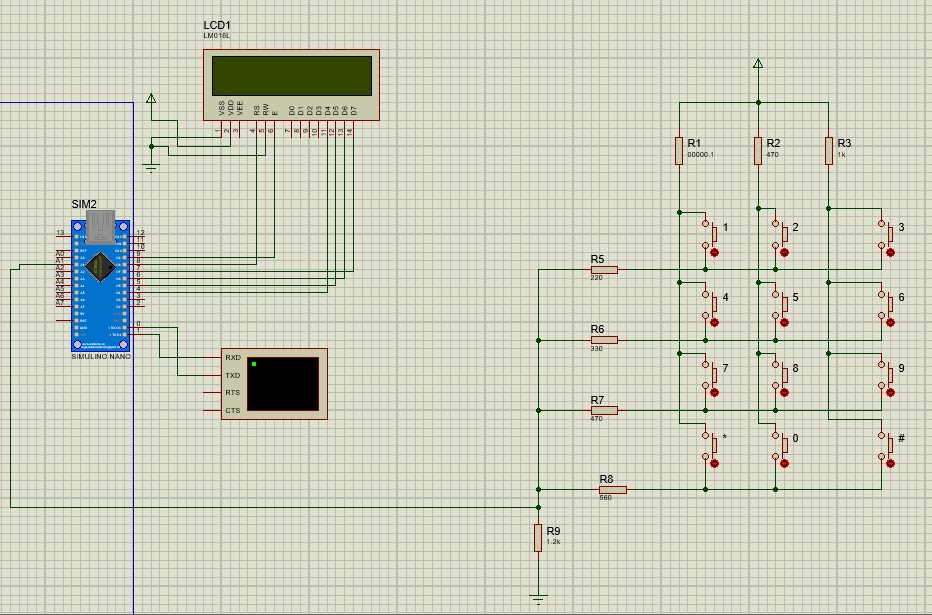

We read the voltage of the pins as follows.
### Read push buttons.
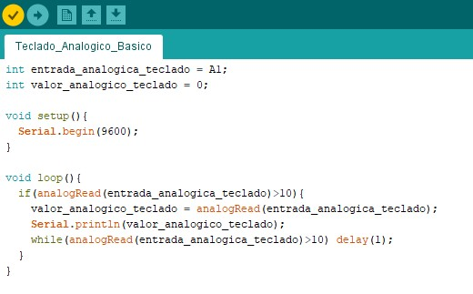

They would give us this data according to the buttons (from left to right).
### Voltaje data.
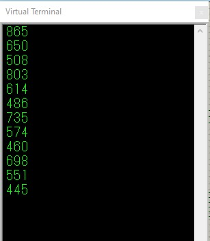

### The data read according to the voltage of the pins.
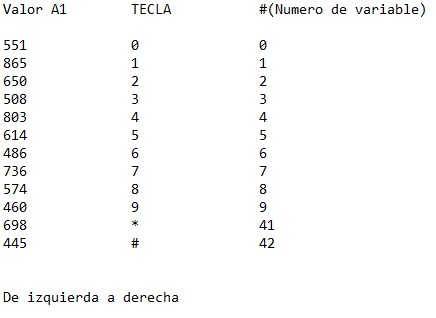

Once we have all the data from the buttons, we configure the reading of pins

### Lectura de pines
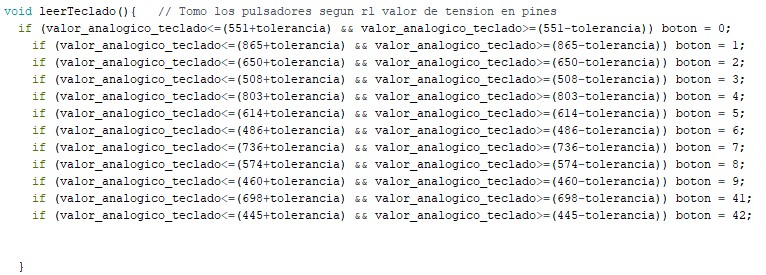

The buttons are loaded as follows (There are two parts that we will explain later)

### Load keyboard
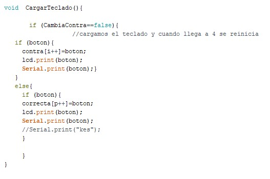

We show the data pressed both on the display and in the virtual Proteus terminal
### Example
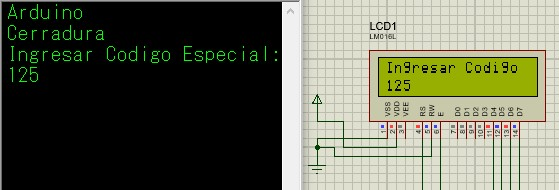

Primero tenemos un código especial, si se inserta el código especial tenemos que ingresar una contraseña de 4 dígitos a nuestro gusto.
Tenemos que comparar dos arreglos. Para esto tenemos que cargar un arreglo llamado contra[] (este es el arreglo que mantiene los datos momentáneos). Una vez cargado este arreglo, tenemos que recorrer tanto el arreglo que nosotros cargamos como el que tenemos como “Código especial”.
Comparamos cada cifra del arreglo dependiendo de la posición. Cada vez una cifra coincida en la misma posición de ambas se aumentará uno en una variable llamada “k”.(Esta en la funcion llamada “CuatroNumeros” al final del informe ).

### Part of the function
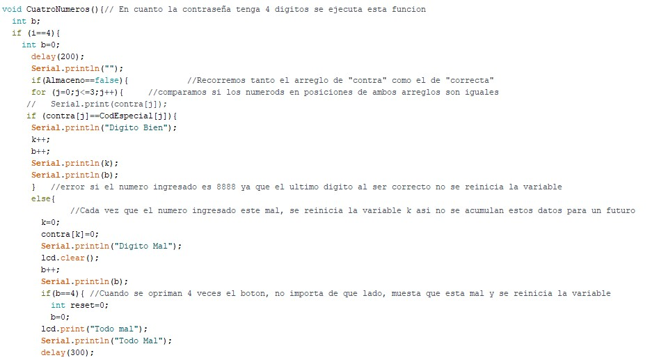

In the event that the password is incorrect, it would show us the following on the screen
### Wrong case

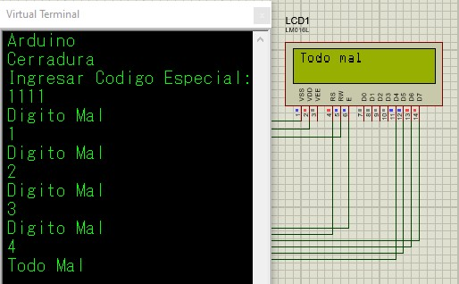

In the event that the four digits are equal, both in value and in position, the following function will be executed to be able to enter a new password.

### Función
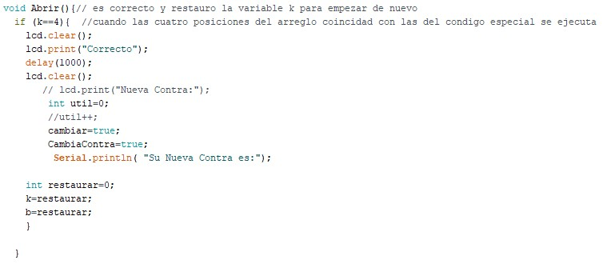

### Nueva Contraseña
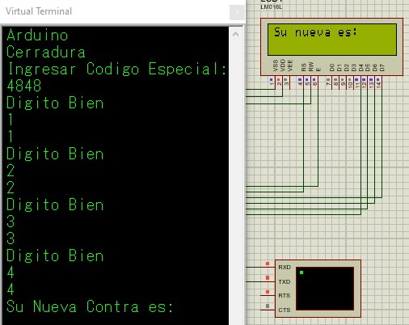

En la funcion “Abrir”, ponemos a pone tanto la variable “cambiar” como “cambiarContra” en true. 
La de “cambiar” la utilizamos para poder usar la función “recorrerContra” y el teclado toma como true a “CambiarContra” para poder utilizar la otra parte de la funcion.

### Contraseña actualizada.
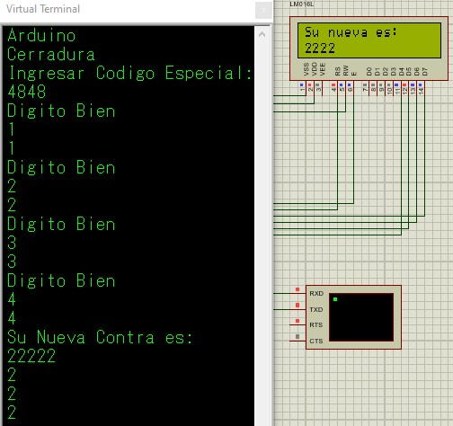

Una vez que elegimos los 4 numeros para nuestra contraseña, se reinicia, pero ya con nuestra contraseña guardada. Si ponemos la contraseña que elegimos después de poner el codigo especial, se tiene que encender el servomotor.

### Comprobamos nueva contraseña
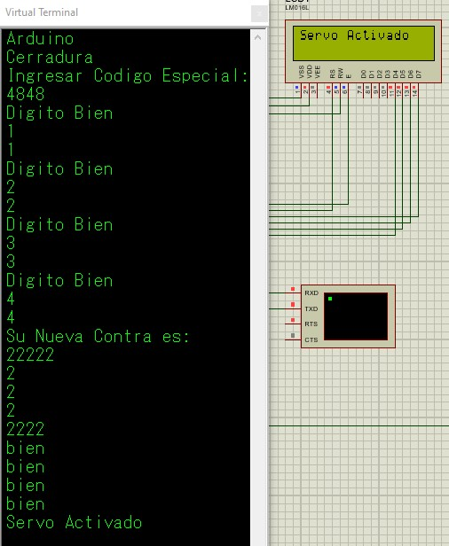

Como la parte del servo estaba en mis temas, se lo deje a mi compañero. Aun así, imprimí un mensaje de que pasaría en el caso de que se activase.
### Conclusión.
En este trabajo tuve problemas en la parte en la que tuve que cargar un arreglo nuevo. Implemente todas las herramientas que vimos estos años además de algunas cosas que fueron de investigación personal.
