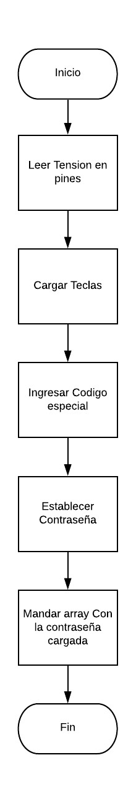

# Cerradura

## Introducción
En este informe veremos tanto la simulación del circuito como la programación en si de una caja fuerte. A continuación, veremos tanto el diagrama de flujo general como el individual.

### Diagrama de flujo General

### Diagrama Teclado

### Esquema del Circuito

